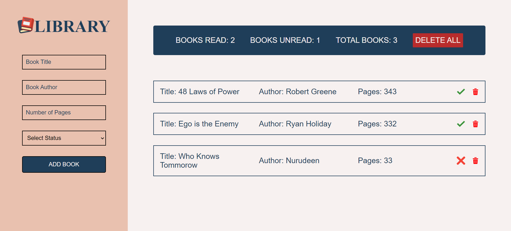
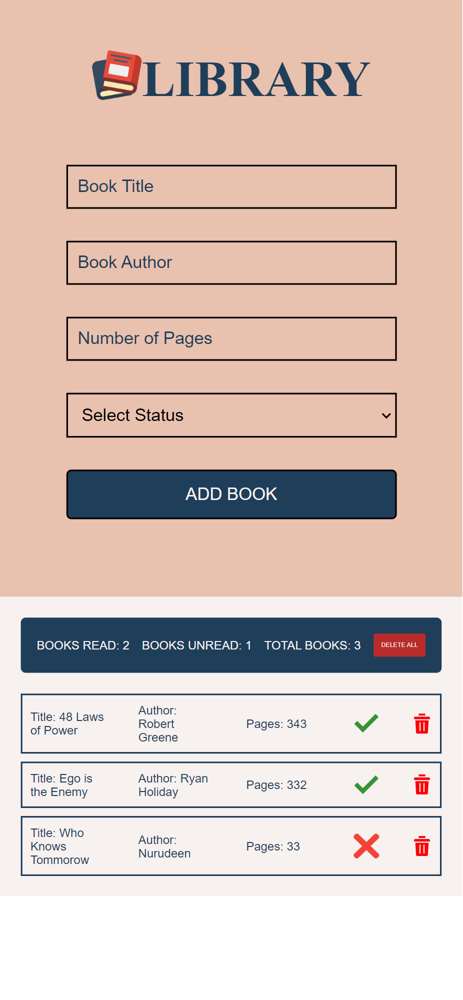

# A-virtual-library

The Library projects on The Odin Project course

This is a solution to the [Library project in The Odin Project curriculum](https://www.theodinproject.com/lessons/node-path-javascript-library).

## Table of contents

- [Overview](#overview)
  - [The challenge](#the-challenge)
  - [Screenshot](#screenshot)
  - [Links](#links)
- [My process](#my-process)
  - [Built with](#built-with)
  - [Tools used](#tools-used)
  - [Features](#features)
  - [What I learned](#what-i-learned)
  - [Continued development](#continued-development)
  - [Useful resources](#useful-resources)
- [Author](#author)
- [Acknowledgments](#acknowledgments)

## Overview

Here is the overview of the entire project;

### Challenges:

- **Storing Book Objects**: Implementing a function to store user input as new book objects in an array.

- **Displaying Books**: Dynamically creating HTML elements to display each book in the array.

- **Adding a New Book Form**: Creating a form for users to input book details and preventing default form submission behavior.

- **Associating DOM Elements with Book Objects**: Linking DOM elements to specific book objects to enable interaction.

- **Removing Books**: Handling user interactions to remove books from the library array and update the UI accordingly.

- **Changing Read Status**: Implementing a button to toggle the read status of a book and updating the UI.

- **User Input Validation**: Validating user input to maintain data integrity and prevent errors.

- **UI/UX Design**: Designing an intuitive interface for adding, displaying, and interacting with books.

### Screenshot

  

### Links

- Source code URL: https://github.com/nuru484/A-virtual-library
- Live Site URL: https://nuru484.github.io/A-virtual-library/
